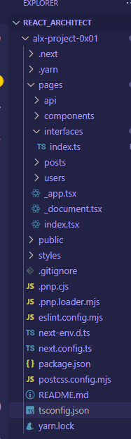

# ALX Project 0x01 - Next.js User & Post App

This is a modern web application built using **Next.js**, **TypeScript**, and **Tailwind CSS**, following atomic design principles. It demonstrates how to build a statically generated site that fetches and displays data from an external API, and allows adding users and posts through dynamic forms and modals.

---

## 🚀 Features

- 🔧 Project setup using Next.js, TypeScript, Tailwind CSS, and ESLint
- 🧩 Reusable components built using atomic design principles
- 📄 Pages for displaying posts and users
- 🔁 Static Site Generation using `getStaticProps`
- 🧠 State management using React hooks
- ➕ Interactive modals for adding new users and posts
- 🎨 Responsive and modern UI with Tailwind CSS

---

## 📁 Project Structure

📌 License
This project is for educational purposes only as part of the ALX Software Engineering program